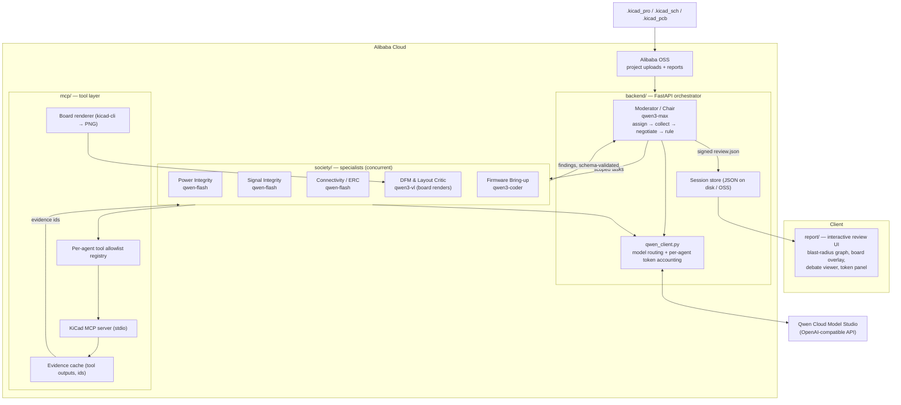

# BoardRoom Architecture

Multi-agent PCB design review society. Track 3 (Agent Society), Qwen Cloud Global AI
Hackathon. See NEGOTIATION_PROTOCOL.md for the debate mechanism and
schemas/finding.schema.json for the finding contract.

## System diagram


<details>
<summary>Mermaid source (same diagram)</summary>



</details>

## Review session lifecycle

1. **Intake** — KiCad project uploaded (OSS bucket) → session created → manifest built
   (`get_schematic_info`, `get_pcb_statistics`, netlist).
2. **Assignment** — Moderator decomposes the review into scopes and dispatches the five
   specialists concurrently, each with a narrow tool allowlist enforced by `mcp/`.
3. **Filing** — specialists call their KiCad MCP tools, receive cached evidence ids,
   and file schema-validated findings. Uncited claims are rejected (hallucination
   metric).
4. **Negotiation** — deterministic conflict detection → bounded 2-round debates with
   one extra tool call per side per round → evidence-cited rulings.
5. **Sign-off** — `review.json`: upheld/merged findings, rulings with rationale,
   per-agent token accounting, coverage notes.
6. **Report** — the `report/` frontend renders the blast-radius graph
   (findings → nets → components), board-image overlays from `board_region`, and the
   debate transcripts.

## Model routing

| Agent | Model | Why |
|---|---|---|
| Moderator | qwen3-max | long-horizon orchestration + adjudication |
| PI / SI / ERC specialists | qwen-flash | tool-heavy, narrow scope — cheap |
| DFM & Layout Critic | qwen3-vl | multimodal: rendered board PNG critique |
| Firmware Bring-up | qwen3-coder | device tree + smoke-test firmware generation |

The cost asymmetry (one expensive chair, five cheap specialists) is the core of the
measured efficiency gain vs. the single qwen3-max baseline — see `benchmark/`.

## Repository layout

```
BoardRoom/
├── CLAUDE.md                  # project conventions + agent team contract
├── LICENSE                    # MIT (must be visible in GitHub About)
├── README.md
├── TASKS.md                   # task board (workstreams, owners, status)
├── ANTIGRAVITY_BRIEF.md       # frontend spec for report/ (contract frozen)
├── .claude/agents/            # the engineering team (9 subagents)
├── backend/
│   ├── requirements.txt
│   └── app/
│       ├── main.py            # FastAPI: sessions, review endpoints, health
│       ├── review.py          # CLI: run a full live review over a project
│       ├── runner.py          # tool-calling specialist loop + manifest builder
│       ├── moderator.py       # assignment, conflict detection, debate, ruling
│       ├── interfaces.py      # Protocol contracts between workstreams
│       ├── qwen_client.py     # model routing, token accounting (ALL calls)
│       └── sessions.py        # session state machine + JSON persistence
├── society/
│   ├── registry.yaml          # agent → model id, tool allowlist, prompt file
│   └── prompts/               # one .md system prompt per specialist
├── mcp/
│   ├── client.py              # stdio MCP client for kicad-mcp-server
│   ├── adapters.py            # typed wrappers per tool
│   ├── allowlist.py           # per-agent tool registry (enforced)
│   ├── evidence.py            # tool-output cache with evidence ids
│   └── render.py              # kicad-cli board → PNG
├── benchmark/
│   ├── corpus/                # fetch scripts + defect-seed patches + ground truth
│   ├── seed.py                # reproducible defect injection
│   ├── run.py                 # python -m benchmark.run --config society|baseline
│   ├── _execute.py            # the single runner seam (mock | real)
│   └── metrics.py             # recall, unmatched, hallucination rate, tokens
├── report/                    # offline review viewer (owned by frontend-engineer)
├── deploy/
│   ├── Dockerfile             # python 3.11 + KiCad + backend
│   ├── alibaba/               # OSS integration (linkable deployment proof)
│   ├── deploy.sh / README.md  # runbook
│   └── smoke.sh               # e2e smoke against deployed instance
├── docs/
│   ├── ARCHITECTURE.md        # this file
│   ├── architecture.png       # rendered diagram (judges may not render mermaid)
│   ├── BENCHMARK.md           # method, results, limitations
│   ├── NEGOTIATION_PROTOCOL.md
│   ├── schemas/finding.schema.json   # FROZEN v1
│   ├── VIDEO_SCRIPT.md
│   ├── DEVPOST.md
│   └── BLOG_DRAFT.md
└── tests/
```

## Submission requirements traceability

| Requirement | Where |
|---|---|
| Public OSS repo, license visible | LICENSE + GitHub About setting |
| Alibaba Cloud deployment proof (code file) | deploy/alibaba/*, backend/app/qwen_client.py |
| Architecture diagram | docs/architecture.png + mermaid source in this file |
| ~3 min public video | docs/VIDEO_SCRIPT.md → YouTube |
| Track identification | Track 3 — Agent Society (docs/DEVPOST.md) |
| Measurable gain vs single agent | docs/BENCHMARK.md + README results table |
